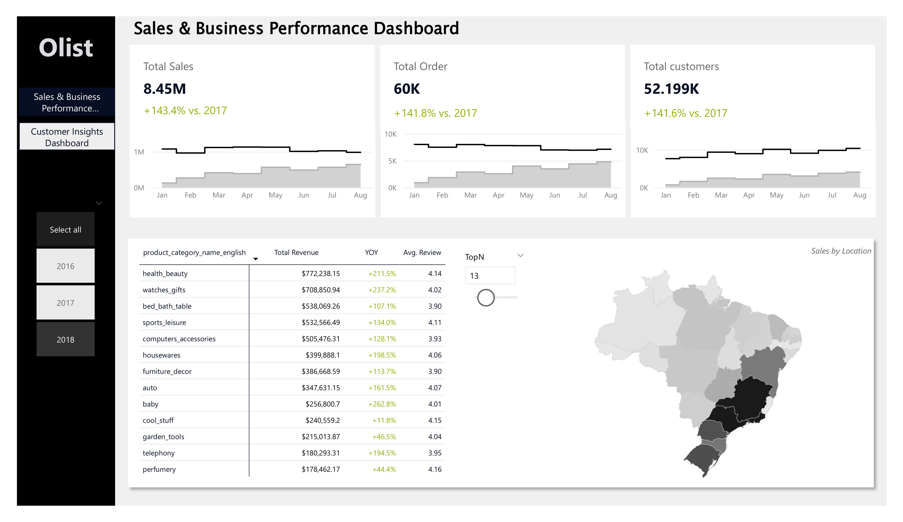
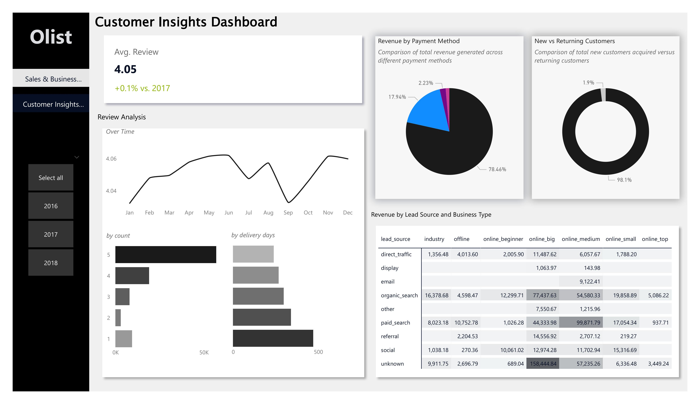

# 📦 Olist E-Commerce Data Analysis

## 📌 Overview

Exploration of the Brazilian **Olist** e-commerce dataset using **SQL** (cleaning, exploration, analytical queries) and **Power BI** (interactive dashboards). The project focuses on **sales performance**, **product trends**, **customer behavior**, **payment mix**, and **delivery impact on reviews**.

### 🔎 Highlights (TL;DR)

* **Sales & Performance**: YoY KPIs for **sales, orders, customers**; product table with **Revenue, YoY, Avg Review** (parameter to control how many products display); **revenue map**.
* **Customer Insights**: **Avg review** KPI; monthly review trend; **review score distribution**; **avg delivery days vs review**; **payment method distribution**; **customer segmentation**; **lead source × business type** metrics table.
* **SQL**: Cleaned categorical text, handled nulls/dupes, computed monthly sales, **new vs returning customers**, **AOV**, **revenue growth**, **category performance + reviews**, **delivery KPIs**.

---

## 🛠 Tech Stack

* **SQL** (specify engine: SQLite/MySQL/Postgres) — cleaning, exploration, metrics
* **Power BI** — dashboard modeling & visuals
* **GitHub** — documentation & version control

---

## 📊 Dashboards

### 1) Sales & Performance Dashboard

* KPIs: **Total Sales, Orders, Customers** with **YoY comparison**
* **Product performance table**: Revenue, YoY, Avg Review (**parameter** controls number of products shown)
* **Revenue by location** (map)




### 2) Customer Insights Dashboard

* KPI: **Average Review**
* **Monthly review trend**
* **Review score counts**
* **Avg delivery days vs review score**
* **Payment method distribution**
* **Customer segmentation**
* **Lead source × business type** metrics table
 



---

## 📂 Repository Structure

```
olist-sql-powerbi-analysis/
│
├── sql/
│   ├── cleaning.sql
│   ├── exploration.sql
│   └── analysis.sql
│
├── dashboards/
│   ├── images/              # PNGs used in README
│   └── pbix/
│       └── olist_dashboard.pbix
│
├── data/
│   └── .gitkeep             # (dataset not committed; see link below)
│
└── README.md
```

---

## 📈 Key Insights  

* **Total revenue showed a clear upward trend**, reflecting steady business growth.  
* **YoY movements** revealed seasonality in sales and shifts in top-performing product categories.  
* **Paid Search and Organic Search** were the dominant channels for customer acquisition.  
* **Returning customers were very few** compared to new customers, suggesting strong acquisition but weak retention. Addressing this gap could unlock significant revenue potential.  
* **Delivery delays** were the main driver of poor reviews, directly affecting customer satisfaction.  
* Despite these challenges, the **average review score held at 4.0**, indicating overall positive customer sentiment.  

---

## 🔗 Dataset

Kaggle — **Brazilian E-Commerce Public Dataset by Olist**
[https://www.kaggle.com/datasets/olistbr/brazilian-ecommerce](https://www.kaggle.com/datasets/olistbr/brazilian-ecommerce)

---

## 📜 License

MIT — see `LICENSE`.
